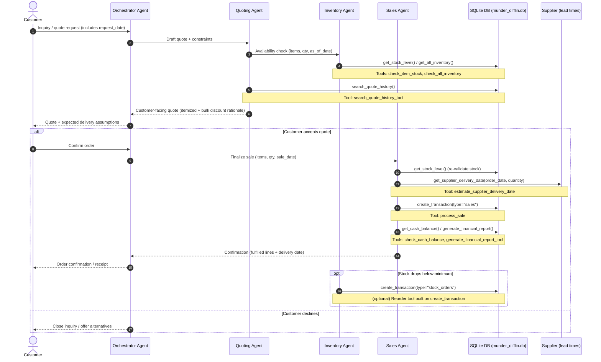
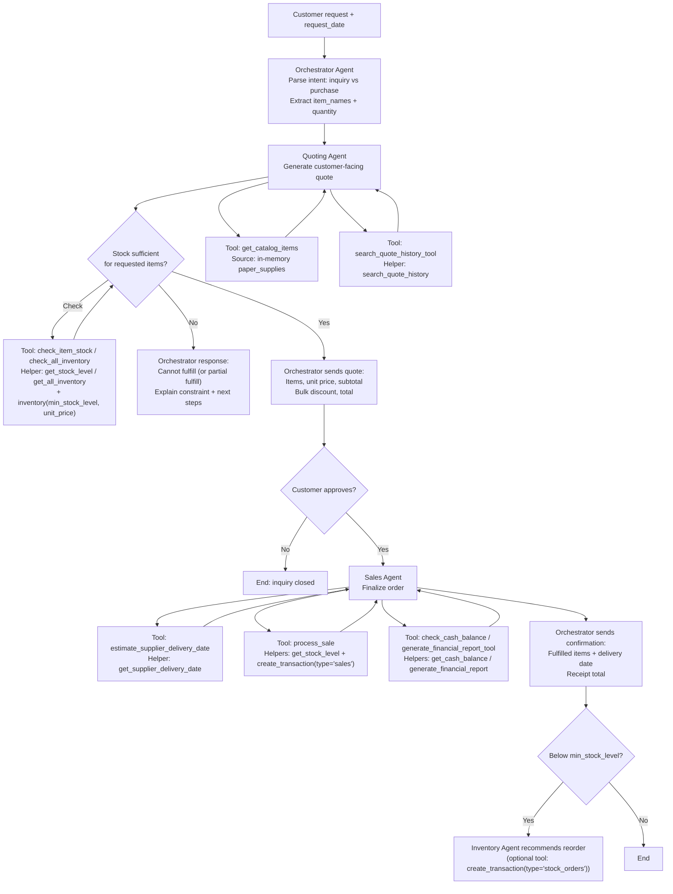

# Beaver's Choice Paper Company — Multi‑Agent Workflow Diagram

This diagram drafts the **agent responsibilities**, **orchestration logic**, and **tool/data flows** for the Beaver's Choice multi‑agent system, aligned to the helper functions and tool stubs in `project_starter.py`.

## Agents (max 5)

- **Orchestrator Agent**: customer-facing entry point; routes work to specialists; composes final response.
- **Inventory Agent**: answers stock questions; flags reorder needs based on `min_stock_level`.
- **Quoting Agent**: generates itemized quotes; consults inventory + catalog + historical quotes; applies bulk discounts.
- **Sales Agent**: confirms fulfillment feasibility; estimates delivery timelines; records sales transactions; can generate reports.

## Tools and their backing helper functions

- **check_all_inventory(as_of_date)** → `get_all_inventory(as_of_date)` (+ reads `inventory` table for `min_stock_level`, `unit_price`)
- **check_item_stock(item_name, as_of_date)** → `get_stock_level(item_name, as_of_date)` (+ reads `inventory` table for `min_stock_level`, `unit_price`)
- **search_quote_history_tool(search_terms, limit)** → `search_quote_history(search_terms, limit)`
- **estimate_supplier_delivery_date(order_date, quantity)** → `get_supplier_delivery_date(order_date, quantity)`
- **process_sale(item_name, quantity, sale_price, sale_date)** → `get_stock_level(...)` then `create_transaction(..., transaction_type="sales", ...)`
- **check_cash_balance(as_of_date)** → `get_cash_balance(as_of_date)`
- **generate_financial_report_tool(as_of_date)** → `generate_financial_report(as_of_date)` (internally uses `get_cash_balance` + `get_stock_level`)
- **(Catalog lookup)** get_catalog_items() → reads in‑memory `paper_supplies` list (no DB helper)

> Optional (often added in implementation): a **reorder tool** that records `transaction_type="stock_orders"` using `create_transaction(...)` when stock falls below `min_stock_level`.

---

## Sequence of operations (end‑to‑end)

---

## Orchestration logic (decision flow)

